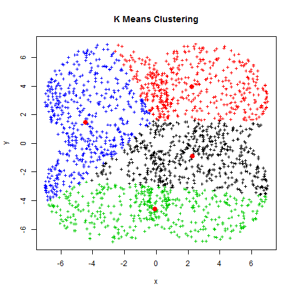

# K-Means Clustering Algorithm
## An Unsupervised Machine Learning Algorithm
#
Clustering is arranged in a way that each observation in the same class possesses similar characteristics and observation of separate groups shows dissimilarity in characteristics. As a part of the unsupervised learning method,clustering attempts to identify a relationship between n-observations( data points) without being trained by the response variable...... 
#

#
K-means algorithm explores for a preplanned number of clusters in an unlabelled multidimensional dataset, it concludes this via an easy interpretation of how an optimized cluster can be expressed. Primarily the concept would be in two steps, firstly,  the cluster center is the arithmetic mean (AM) of all the data points associated with the cluster. Secondly, each point is adjoint to its cluster center in comparison to other cluster centers. These two interpretations are the foundation of the k-means clustering model.
#
#### The repository contains 5 correlated modules ::::

    -->> 1. K-Means Algorithm
    
    -->> 2. Real World Algorithm Implementation

    -->> 3. Developing Own K-Means Algorithm
    
    -->> 4. K-Means Using Plotly

    -->> 5. K-Means++ Algorithm
#
